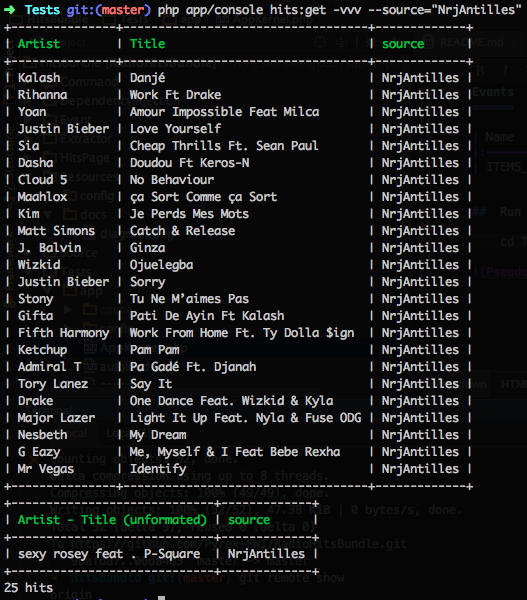
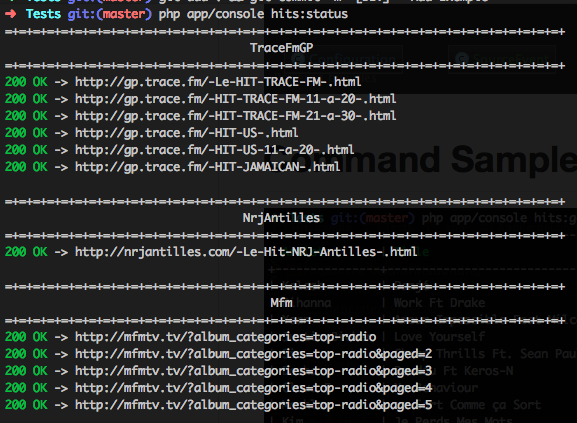

[](http://gitlab.cpyree.com/Pyrex-Fwi/HitsBundle/commits/master)

HitsBundle
===============

## Radio extractors

  Radio                                | Genres
  -----------------------------------  | -------------
  [Mfm](http://mfmtv.tv) [cfg](Resources/config/radio_mfm.yml)              | Zouk, 
  [Nrj](http://nrjantilles.com) [cfg](Resources/config/radio_nrj.yml)         | Zouk, 
  [TraceFM GP](http://gp.trace.fm) [cfg](Resources/config/radio_trace.xml)      | Zouk, 

Events
======

| Name                         |                                                                                  |
|:---------------------------- |:--------------------------------------------------------------------------------:|
| HitsBundleEvent::ITEMS_POST_EXTRACT              | Where all items are available for a specific radio   |


Services
========


  Name                                 | Class
  -----------------------------------  | -------------
  console.command.hitsbundle_command_getcommand      |alias for "hits.command.get"    
  console.command.hitsbundle_command_statuscommand   |alias for "hits.command.status" 
  hits.command.get                                   |HitsBundle\Command\GetCommand   
  hits.command.status                                |HitsBundle\Command\StatusCommand
  source.mfm                                         |HitsBundle\Source\Source        
  source.nrjantilles                                 |HitsBundle\Source\Source        
  source_manager                                     |HitsBundle\Source\SourceManager 
  source_trace                                       |HitsBundle\Source\Source        
  

##  Run test

```sh
Tests/bin/behat Tests/  --config Tests/behat.yml 
cd Tests && bin/behat
```


Command Sample
==============

## Get current Hit list for a specific radio



## Get status of registered radio page


