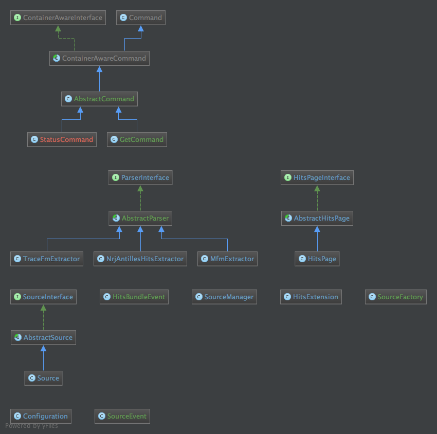

HitsBundle
===============

## Radio extractors

  Radio                                | Genres
  -----------------------------------  | -------------
  [Mfm](http://mfmtv.tv) [cfg](Resources/config/radio_mfm.yml)              | Zouk, 
  [Nrj](http://nrjantilles.com) [cfg](Resources/config/radio_nrj.yml)         | Zouk, 
  [TraceFM GP](http://gp.trace.fm) [cfg](Resources/config/radio_trace.xml)      | Zouk, 

Events
======

| Name                         |                                                                                  |
|:---------------------------- |:--------------------------------------------------------------------------------:|
| ITEMS_POST_EXTRACT              | Where all items are available for en radio   |

##  Run test

    cd Tests && bin/behat

